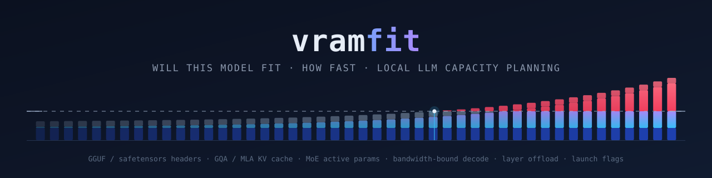

[](https://github.com/johan-becker/vramfit/actions/workflows/ci.yml)
[](https://www.typescriptlang.org/)
[](https://nodejs.org/)
[](package.json)
[](LICENSE)

`vramfit` answers the most-asked question in local LLM self-hosting — *will
this model run on my machine, and how fast?* — with arithmetic instead of
forum guesswork.

I built it because every VRAM calculator I tried was wrong in a way that cost
gigabytes: it treated `Q4_K_M` as four bits per weight, or sized the KV cache
from the query-head count instead of the KV-head count, or forgot that the
CUDA runtime takes 0.7 GiB before a single tensor is allocated. Every formula
here is written down with its assumption, unit-tested against a hand-computed
value, and — where external ground truth exists — calibrated against published
GGUF file sizes and llama.cpp benchmark tables. TypeScript, ESM, Node 20+,
library and CLI, zero runtime dependencies.

## 1. The problem

You have 24 GB of VRAM and you want to run a 70B at 32K context. Somebody on a
forum says it fits. Somebody else says you need two cards. The model card
quotes a parameter count, the GGUF repo quotes a file size, and neither tells
you what the KV cache costs at your context length or what happens to your
tokens per second when three layers spill into system RAM.

Every one of these is a real mistake in a widely used calculator, and each is
worth gigabytes:

| Mistake | What it costs |
| --- | --- |
| Treating `Q4_K_M` as 4 bits per weight | 18% low on Llama 3.1 8B — the mix is 4.83 bpw |
| Sizing the KV cache from `n_heads` instead of `n_kv_heads` | Up to **8x** too large on any modern GQA model |
| Ignoring that k-quants promote the output head to Q6_K | 0.11 GB on an 8B — the head alone is 0.43 GB of a 4.96 GB file |
| Charging a tied embedding table twice | 12% of a Llama 3.2 3B file |
| Ignoring interleaved sliding-window attention | 5x too large on Gemma 3 at 32K |
| Ignoring MLA on DeepSeek | 7x too large |
| Forgetting the ~0.7 GiB CUDA runtime context | The difference between "fits" and OOM at 95% utilisation |
| Sizing MoE speed by total parameters | Mixtral decodes like a 13B, not a 47B |

`vramfit` gets all eight right, and says out loud which of its numbers are
arithmetic and which are estimates with an error band.

## 2. Quickstart

```sh
npx vramfit check llama-3.1-8b --device 4090 --ctx 32k   # no install
npm install -g vramfit                                    # CLI
npm install vramfit                                       # library
```

`check` exits **0** when the configuration fits, **1** when it does not and
**2** on bad usage, so it can gate a deploy script:

```sh
vramfit check "$MODEL" --device 4090 --ctx 32k --json > plan.json \
  || { echo "won't fit, refusing to deploy"; exit 1; }
```

## 3. A worked example

Everything below is real output from the build in this repository, pasted
unedited.

```console
$ vramfit check llama-3.1-8b --device 4090 --ctx 32k
Llama 3.1 8B  |  Q4_K_M  |  NVIDIA RTX 4090
===========================================

FITS  -  9.47 GiB of 24.00 GiB used, 14.53 GiB free (39% utilised)

Memory
  Weights           4.62 GiB  8.03B params at 4.94 effective bits/weight
  KV cache          4.00 GiB  32K tokens, 32 layers x 8 KV heads x 128, f16
  Runtime context   0.70 GiB  cuda-consumer driver and kernels
  Compute buffer    0.15 GiB  activations, logits and graph scratch
  Total             9.47 GiB  at Q4_K_M
  Available        24.00 GiB  NVIDIA RTX 4090

Capacity
  Largest context that fits    128K  the architecture's own maximum
  Best quant that fits at 32K   F16  14.96 GiB of weights, 39.2 tok/s

Speed (estimates: decode +/-25%, prefill +/-40%)
  Decode               67.4 tok/s  at 32K context, 1 sequence
  Prefill              2450 tok/s  23.6 GFLOP per prompt token
  Time to first token      13.4 s  for a prompt of 32K tokens
```

The same question for every quantization at once, with the largest context and
the decode speed each one leaves room for:

```console
$ vramfit best qwen2.5-32b -d 4090 --ctx 8k
Qwen2.5 32B  |  NVIDIA RTX 4090
===============================

Quant     bpw    Weights  Total at 8K  Fits  Max ctx        Decode
------  -----  ---------  -----------  ----  -------  ------------
F16     16.00  61.03 GiB    63.97 GiB    no        -  1.43 tok/s *
BF16    16.00  61.03 GiB    63.97 GiB    no        -  1.43 tok/s *
Q8_0     8.50  32.42 GiB    35.37 GiB    no        -    3.75 tok/s
Q6_K     6.56  25.02 GiB    27.97 GiB    no        -    8.73 tok/s
Q5_K_M   5.67  21.71 GiB    24.65 GiB    no     5.3K    18.9 tok/s
Q5_K_S   5.52  21.15 GiB    24.10 GiB    no     7.6K    19.2 tok/s
Q4_K_M   4.83  18.58 GiB    21.53 GiB   yes    17.8K    27.8 tok/s
Q4_K_S   4.57  17.61 GiB    20.56 GiB   yes    21.7K    29.0 tok/s
Q4_0     4.55  17.54 GiB    20.48 GiB   yes    22.0K    29.1 tok/s
Q3_K_M   3.91  15.07 GiB    18.02 GiB   yes    31.9K    32.8 tok/s
Q2_K     3.35  12.91 GiB    15.86 GiB   yes    40.5K    37.6 tok/s

Rows that do not fit show the decode speed with as many layers as possible
offloaded to system RAM, which is what you would actually get.

* the offloaded remainder needs more system RAM than the 32.00 GiB assumed
here, so that row would not load at all. Say what you have with --ram.

Recommended: Q4_K_M -- highest quality that fits at 8K, 27.8 tok/s.
  The default recommendation: best quality-per-byte in the GGUF lineup for
  most models.
```

## 4. How it works

### 4.1 Weights

```
bytes = params x bits_per_weight / 8
```

with three corrections that decide whether the answer is useful. GGUF k-quants
are **not** their nominal width — a `Q4_K_M` stores super-blocks of 256 weights
with two levels of scales and promotes selected tensor types, landing at 4.83
bits per weight. Every k-quant mix promotes the logit matrix to `Q6_K`. And a
tied embedding table is stored once, not twice.

Predicted file size against the GGUF you would actually download, next to the
naive `params x nominal_bits / 8`:

| Model | Quant | Published | `vramfit` | Naive |
| --- | --- | ---: | ---: | ---: |
| Llama 3.2 3B | Q4_K_M | 2.02 GB | 2.02 GB (+0.2%) | 1.61 GB (−20.5%) |
| Llama 3.1 8B | Q4_K_M | 4.92 GB | 4.96 GB (+0.9%) | 4.02 GB (−18.4%) |
| Llama 3.1 8B | Q8_0 | 8.54 GB | 8.53 GB (−0.1%) | 8.03 GB (−6.0%) |
| Llama 3.3 70B | Q4_K_M | 42.52 GB | 42.82 GB (+0.7%) | 35.28 GB (−17.0%) |
| Mistral 7B v0.3 | Q4_K_M | 4.37 GB | 4.41 GB (+0.8%) | 3.62 GB (−17.1%) |
| Qwen2.5 32B | Q4_K_M | 19.85 GB | 19.95 GB (+0.5%) | 16.38 GB (−17.5%) |
| Gemma 2 9B | Q4_K_M | 5.76 GB | 5.78 GB (+0.3%) | 4.62 GB (−19.8%) |
| Phi-4 14B | Q4_K_M | 9.05 GB | 8.96 GB (−1.0%) | 7.33 GB (−19.0%) |

Published sizes are the file listings of the `bartowski` conversions; the full
table lives in `test/gguf-sizes.test.ts`, which asserts 2% on every dense row.

### 4.2 KV cache

```
bytes = 2 x n_layers x n_kv_heads x head_dim x ctx x batch x bytes_per_element
        ^-- K and V
```

`n_kv_heads`, never `n_heads`. Llama 3.3 70B has 64 query heads and 8 KV heads;
using 64 makes the cache come out exactly eight times too large, which turns
"a 70B at 32K fits in 48 GB" into "you need an H100". Two architectures need a
different formula entirely:

- **Multi-head Latent Attention** (DeepSeek V2/V3) caches one compressed latent
  plus a decoupled RoPE key, shared across every head:
  `n_layers x (kv_lora_rank + qk_rope_head_dim) x ctx x batch x bpe`. No factor
  of two and no head count — 576 elements per token per layer instead of 4096.
- **Interleaved sliding-window attention** (Gemma 2/3, gpt-oss) caps most
  layers at `window_size` tokens and keeps only every Nth layer global.

At 32K tokens, batch 1, `f16` — measured against what the naive `n_heads`
formula would have charged:

| Model | Attention | `vramfit` | Naive `n_heads` |
| --- | --- | ---: | ---: |
| Llama 3.3 70B | GQA 64→8 | 10.00 GiB | 80.00 GiB (8.0x) |
| Qwen2.5 7B | GQA 28→4 | 1.75 GiB | 12.25 GiB (7.0x) |
| Gemma 3 27B | GQA + SWA, 52 of 62 layers windowed at 1024 | 2.91 GiB | 31.00 GiB (10.7x) |
| DeepSeek-V2-Lite | MLA | 0.95 GiB | 6.75 GiB (7.1x) |

KV quantization uses the exact block layouts rather than the nominal width:
`f16` = 2 bytes/element, `q8_0` = 1.0625, `q4_0` = 0.5625.

### 4.3 Mixture of experts

Total parameters drive **memory**; active parameters per token drive **speed**.
Mixtral 8x7B occupies 46.70B parameters of memory and multiplies 12.88B of them
per token, so it needs the VRAM of a 47B and decodes at roughly the speed of a
13B. Both figures are derived from the architecture fields, not copied from a
headline.

### 4.4 Overheads

Two empirical terms, labelled as such in the report:

- **Runtime context** — the CUDA primary context, kernel image and cuBLAS
  workspaces: ~0.7 GiB consumer, ~1.0 GiB datacenter, ~0.5 GiB Metal. Charged
  once *per device*, which is why the second GPU in a pair gives you less than
  its sticker capacity.
- **Compute buffer** — activations, FP32 logits and graph scratch, scaling with
  the physical batch (`--ubatch`) rather than the context, plus the
  `ubatch x ctx x n_heads` score matrix when flash attention is off.

Assume ±0.3 GiB on the first and ±50% on the second.

### 4.5 Throughput

Decode is memory-bandwidth bound: every active weight is read once and
multiplied against a single vector, roughly one FLOP per byte.

```
tokens/second = bandwidth x efficiency / (active_weight_bytes + kv_bytes)
```

The KV term is why long conversations get slower — attention re-reads the whole
cache for every token it emits.

Efficiency is two tables rather than one constant, because one constant cannot
fit the data. At 16 bits decode is purely bandwidth-bound and reaches 0.70–0.85
of peak, depending on the backend. At 4 bits it does not, because unpacking the
weights is real work and how much it costs depends on the backend's kernels;
the penalty is interpolated linearly in bits between those two anchors.
Calibrated against published llama.cpp `tg128` results for the original
LLaMA 7B, the model those tables are quoted for:

| Device | Quant | Measured | `vramfit` |
| --- | --- | ---: | ---: |
| M2 Ultra | F16 | 42.75 tok/s | 42.2 (−1.4%) |
| M2 Ultra | Q4_0 | 88.64 tok/s | 92.7 (+4.6%) |
| RTX 4090 | Q4_0 | 152.2 tok/s | 155.0 (+1.8%) |

The interesting row is the middle one: Metal only gets 2.07x from F16 → Q4_0
where the byte counts imply 3.5x, and reproducing that gap is exactly what the
per-family dequantization table is for.

Prefill is compute bound — `2 x active_params` FLOPs per token for the matmuls
plus the attention matmuls, against the device's FP16 TFLOPs at a documented
model-FLOPs-utilisation figure.

**These are estimates**, and the report says so on the same line: ±25% on
decode, ±40% on prefill. They answer "which order of magnitude, and would a
different quant help", not "what will my benchmark print".

## 5. When it does not fit

"It does not fit" is almost never the end of the story, so `vramfit` models
llama.cpp's `--n-gpu-layers` placement: as many transformer blocks as fit go
into device memory, each taking its own slice of the KV cache, filled from the
tail, with the vocabulary tensors placed only once every layer is already
resident.

```console
$ vramfit check llama-3.3-70b -d 3090 --ctx 8k --ram 64
Llama 3.3 70B  |  Q4_K_M  |  NVIDIA RTX 3090
============================================

DOES NOT FIT  -  43.39 GiB needed, 24.00 GiB available, 19.39 GiB short

Memory
  Weights          39.88 GiB  70.55B params at 4.86 effective bits/weight
  KV cache          2.50 GiB  8K tokens, 80 layers x 8 KV heads x 128, f16
  Runtime context   0.70 GiB  cuda-consumer driver and kernels
  Compute buffer    0.31 GiB  activations, logits and graph scratch
  Total            43.39 GiB  at Q4_K_M
  Available        24.00 GiB  NVIDIA RTX 3090

Capacity
  Largest context that fits   none  Q4_K_M, batch 1, f16 cache
  Best quant that fits at 8K  none  try a smaller model, a longer offload or more memory

Partial offload
  Layers in device memory   44 of 80  vocabulary tensors in system RAM
  Left in system RAM       19.84 GiB  of 64.00 GiB assumed available
  Blended read bandwidth    175 GB/s  harmonic mean; the device alone reads at 936 GB/s

Speed (estimates: decode +/-25%, prefill +/-40%)
  Decode                2.05 tok/s  blended across 44 device and 36 host layers
  Prefill               8.65 tok/s  149.7 GFLOP per prompt token
  Time to first token  15 min 47 s  for a prompt of 8K tokens
```

The blended bandwidth is a harmonic mean weighted by the bytes read from each
side — harmonic, because the slow side dominates the time. Moving 10% of a
model off a 1008 GB/s RTX 4090 into 89.6 GB/s DDR5 does not cost 10% of the
speed: the blended figure falls to 498 GB/s, less than half.

`--gpus N` splits across an identical set of devices instead. Weights and cache
are shared, but each device pays the runtime context and compute buffer in
full, and a layer split does not raise decode speed — so the report says that
rather than quietly multiplying:

```console
$ vramfit check llama-3.3-70b -d 3090 -g 2 --ctx 8k
Llama 3.3 70B  |  Q4_K_M  |  2 x NVIDIA RTX 3090
================================================

FITS  -  44.39 GiB of 48.00 GiB used, 3.61 GiB free (92% utilised)
...
  Runtime context   1.40 GiB  cuda-consumer driver and kernels, x2 devices
...
Notes
  - Each of the 2 devices pays the runtime context and compute buffer in full,
    and a layer split does not raise decode speed -- extra devices buy
    capacity, not tokens per second.
```

## 6. Reference

### 6.1 Commands

| Command | Purpose | Exit |
| --- | --- | --- |
| `vramfit check <model> --device <d>` | Full report for one model, quant, context and device | 0 fits / 1 does not / 2 usage |
| `vramfit best <model> --device <d>` | Every quantization ranked by quality, with max context and decode speed | 0 something fits / 1 nothing in the range fits at this context / 2 usage |
| `vramfit devices` | List the 29 bundled devices | 0 / 2 |
| `vramfit models` | List the 24 bundled models | 0 / 2 |

### 6.2 Options

| Option | Meaning |
| --- | --- |
| `-d, --device <id>` | Bundled device id, name or alias (`4090`, `"RTX 4090"`, `m3-max`) |
| `-q, --quant <id>` | Weight quantization; defaults to the format the model ships in (MXFP4 for gpt-oss), else `q4_k_m` |
| `-c, --ctx <n>` | Context length; `32768` or `32k`. Defaults to the model's own default |
| `-b, --batch <n>` | Concurrent sequences, default 1 |
| `-g, --gpus <n>` | Identical devices sharing the model, default 1 |
| `--kv-quant <id>` | `f16`, `q8_0`, `q5_1`, `q5_0`, `q4_1`, `q4_0` |
| `--vram <GiB>` | Usable memory per device, used as given -- not scaled again by the device's usable fraction |
| `--ubatch <n>` | Physical batch (llama.cpp `--ubatch-size`), default 512 |
| `--no-flash-attn` | Model the compute buffer without flash attention |
| `--prompt <n>` | Prompt length for time-to-first-token |
| `--ram <GiB>` | System RAM available for offloaded layers |
| `--ram-bandwidth <GB/s>` | System RAM bandwidth, default 89.6 (DDR5-5600) |
| `--cpu-tflops <n>` | CPU dense FP16 throughput, for offloaded prefill |
| `--efficiency <0-1>` | Override the device's memory-bandwidth efficiency; offloaded layers keep their derived figure |
| `--prefill-efficiency <0-1>` | Override the device's prefill MFU, on the same terms |
| `--model-json <path>` | Use a model spec from a file instead of the database |
| `--device-json <path>` | Use a device spec from a file instead of the database |
| `--json` | Machine-readable output |
| `-h, --help` / `-v, --version` | Usage text / version |

### 6.3 Quantizations

Effective bits per weight, before the embedding and output-head promotions:

| Quant | bpw | Quant | bpw | Quant | bpw |
| --- | ---: | --- | ---: | --- | ---: |
| `f16` / `bf16` | 16.00 | `q4_k_m` | 4.83 | `mxfp4` | 4.25 |
| `q8_0` | 8.50 | `q4_k_s` | 4.57 | `awq-4bit` | 4.25 |
| `q6_k` | 6.56 | `q4_0` | 4.55 | `gptq-4bit` | 4.25 |
| `q5_k_m` | 5.67 | `q3_k_m` | 3.91 | | |
| `q5_k_s` | 5.52 | `q2_k` | 3.35 | | |

### 6.4 JSON output

`--json` writes one object to stdout and nothing else, so it pipes straight
into `jq`. Every quantity is in base units: bytes for memory, decimal bytes per
second for bandwidth, tokens per second for rates, seconds for durations,
tokens for context and prompt lengths. GiB appear only in the human report.
Keys are added over time, but the ones below keep their name and meaning.

`vramfit check --json`:

| Key | Contents |
| --- | --- |
| `vramfit` | Version that produced the payload |
| `fits` | The verdict, matching the exit code |
| `model` | `id`, `name`, `totalParams`, `activeParams`, `nLayers`, `nKvHeads`, `headDim`, `attention`, `moe` |
| `device` | `id`, `name`, `family`, `vramGiB`, `bandwidthGBs`, `usableFraction`, `count` |
| `config` | `quant`, `bitsPerWeight`, `effectiveBitsPerWeight`, `ctx`, `batch`, `kvQuant` |
| `memory` | `weightsBytes`, `kvCacheBytes`, `runtimeContextBytes`, `activationBytes` — which sum to `totalBytes` — plus `capacityBytes`, `headroomBytes`, `utilization` |
| `capacity` | `maxContext`, `recommendedQuant` (id or `null`) |
| `throughput` | `decodeTokensPerSecond`, `aggregateDecodeTokensPerSecond`, `prefillTokensPerSecond`, `promptTokens`, `timeToFirstTokenSeconds`, `decodeErrorBand`, `prefillErrorBand` |
| `offload` | `null` when the model is fully resident, otherwise `gpuLayers`, `cpuLayers`, `vocabOnDevice`, `systemRamRequiredBytes`, `systemRamAvailableBytes`, `feasible`, `blendedBandwidthBytesPerSecond` |
| `warnings` | The strings the report prints under *Notes* |

`vramfit best --json` returns `vramfit`, `model`, `device`, `ctx`,
`recommended` (a quant id or `null`) and `quants[]`, one entry per candidate
with `id`, `label`, `bitsPerWeight`, `qualityRank`, `weightsBytes`,
`totalBytes`, `fits`, `maxContext`, `decodeTokensPerSecond`, `offloadFeasible`
and `systemRamRequiredBytes`. `devices --json` and `models --json` print the
bundled `DeviceSpec[]` and `ModelSpec[]` as they are.

```sh
vramfit check llama-3.1-8b -d 4090 --ctx 32k --json \
  | jq '.memory.totalBytes / 1073741824, .throughput.decodeTokensPerSecond'
```

### 6.5 Library

```ts
import { checkFit, getDevice, getModel, getQuant, recommendQuant } from "vramfit";

const fit = checkFit(getModel("llama-3.1-8b"), getQuant("q4_k_m"), getDevice("4090"), {
  ctx: 32_768,
});

fit.fits;                               // true
fit.headroomBytes;                      // 15597252060.16
fit.utilization;                        // 0.3947469606002172
fit.maxContext;                         // 131072
fit.footprint.kv.totalBytes;            // 4294967296
fit.throughput.decode.tokensPerSecond;  // 67.4244625650359
fit.offload;                            // null -- it is fully resident
fit.warnings;                           // []

recommendQuant(getModel("qwen2.5-32b"), getDevice("4090"), { ctx: 8192 })?.quant.label;
// "Q4_K_M"
```

Every layer is exported and usable on its own — `computeWeightBytes`,
`computeKvCacheBytes`, `computeActivationBytes`, `computeFootprint`,
`estimateThroughput`, `planOffload`, `blendBandwidth`, `maxContextFor`,
`evaluateQuants`, `deriveArchitecture` — along with the quantization tables,
the device and model registries, and the validators that parse user-supplied
specs. The arithmetic is pure: plain data in, plain data out, no global state.
The only I/O in the package is a lazy, memoised read of the bundled JSON, and
it only happens if you ask for a bundled model or device by name.

### 6.6 Bundled data, and bringing your own

`vramfit devices` lists 29 devices: NVIDIA RTX 3060 12GB through 5090, A100
40/80GB, H100 80GB SXM5, L40S, AMD RX 7900 XTX, Apple M1–M4 in Pro/Max/Ultra
variants with their unified-memory bandwidth and the macOS wired-memory limit,
and generic CPU tiers from dual-channel DDR4-3200 to 8-channel DDR5-4800.

`vramfit models` lists 24 models: Llama 3.1/3.2/3.3 (1B–70B), Qwen 2.5 (7B–72B),
Qwen 3 including the 30B-A3B and 235B-A22B MoEs, Mistral 7B v0.3, Mixtral
8x7B, Gemma 2 (9B/27B), Gemma 3 (4B/12B/27B), Phi-4, DeepSeek-V2-Lite (MLA)
and gpt-oss 20B/120B.

Every device figure comes from a vendor datasheet and every model figure from
that model's published `config.json`; both carry their source string in the
JSON. The test suite re-derives each model's parameter count from its own
architecture fields and requires the result within 0.5% of the published count
— the worst of the 24 is Gemma 3 12B at 0.040%.

The database is a convenience, not a limit. Anything matching `ModelSpec` /
`DeviceSpec` works, from a file or from code:

```sh
vramfit check --model-json ./my-finetune.json --device-json ./my-gpu.json --ctx 4k
```

User-supplied specs go through the same validator as the bundled data, which
enforces the invariants that keep the arithmetic honest — the declared
parameter count has to match the count the shape fields imply, query heads must
divide evenly into KV head groups, an MLA model must carry MLA geometry, a
router cannot pick more experts than exist — and names the exact field path
when they do not.

A model released in a quantization of its own says so with `nativeQuant`, as
the two gpt-oss entries do. That format is then the default for `check` and the
top of the `best` table, and wider quantizations of it are left out: a Q8_0 of
an MXFP4 checkpoint is twice the bytes for weights that were never wider than
4.25 bits.

## 7. Accuracy and limitations

- Memory figures are **arithmetic**, and only as good as their inputs. Weight
  sizes land within 2% of published GGUF files for every dense model in the
  test table.
- **MoE k-quant mixes** quantize expert tensors more narrowly than the dense
  `_M` recipe, so Mixtral 8x7B Q4_K_M is predicted about 7% high. High is the
  safe direction for a "will it fit" tool, and the gap is pinned by a test
  rather than left to be discovered.
- Throughput is an **estimate** with a stated band (±25% decode, ±40%
  prefill). It is most optimistic for a small model on a datacenter GPU at
  batch 1, where decode is latency-bound rather than bandwidth-bound.
  `--efficiency` lets you calibrate against your own measurement.
- Multi-GPU assumes a **homogeneous layer split**. Tensor-parallel runtimes
  scale decode throughput; this does not model that, and it does not model
  heterogeneous cards.
- The runtime context and compute buffer are **empirical**, not derived. They
  are backend- and version-dependent; treat them as ±0.3 GiB and ±50%.
- There is no model download, no GGUF header parsing and no device probing.
  `vramfit` never touches the network, at runtime or in its tests.

## 8. Development

```sh
npm install
npm run lint       # oxlint, warnings are errors
npm run typecheck  # tsc --noEmit over src, test, scripts and the vitest config
npm run build      # tsc + copy the bundled JSON into dist/
npm test           # vitest -- 278 tests across 13 files
npm run smoke      # spawn the built binary and assert its output and exit codes
```

Tests never touch the network: everything is arithmetic over fixtures and
bundled JSON, so the suite passes offline. The fixtures in `test/fixtures.ts`
are deliberately independent of `src/data/models.json`, because a test that
reads the same file the code reads can only catch a bad lookup, never a bad
formula.

CI runs the whole chain on Node 20, 22 and 24 on Linux plus Node 22 on macOS
and Windows, then packs the tarball, installs it into a clean project, and runs
the installed binary and library from there — the only way to catch a `files`
list that forgot `dist/data`, a `bin` path that does not resolve, or an
`exports` map a consumer cannot import.

See [CONTRIBUTING.md](CONTRIBUTING.md) for the commit convention and what a
pull request is expected to carry, [SECURITY.md](SECURITY.md) for private
vulnerability reports, and [CHANGELOG.md](CHANGELOG.md) for the release record.
Participation is governed by the [Code of Conduct](CODE_OF_CONDUCT.md).

## 9. License

vramfit is **open source**, licensed under the
[Apache License, Version 2.0](LICENSE).

**What you may do:** use, modify and redistribute vramfit for any purpose,
including commercially and inside proprietary products, at any organisation
size — there is no separate licence to buy and nobody to ask.

**What the licence asks in return:** keep the copyright and licence notices,
state any significant changes you made, and include the [NOTICE](NOTICE) file
with any redistribution. The full conditions are in section 4 of the
[LICENSE](LICENSE).

**Patents are covered.** Apache-2.0 grants an express, royalty-free patent
licence from every contributor, and that grant terminates for anyone who
brings a patent claim alleging that the project infringes their patents.

Contributions are taken under the Developer Certificate of Origin and are
licensed under the same Apache License, Version 2.0 — see
[CONTRIBUTING.md](CONTRIBUTING.md).

Copyright © 2026 Johan Becker.
